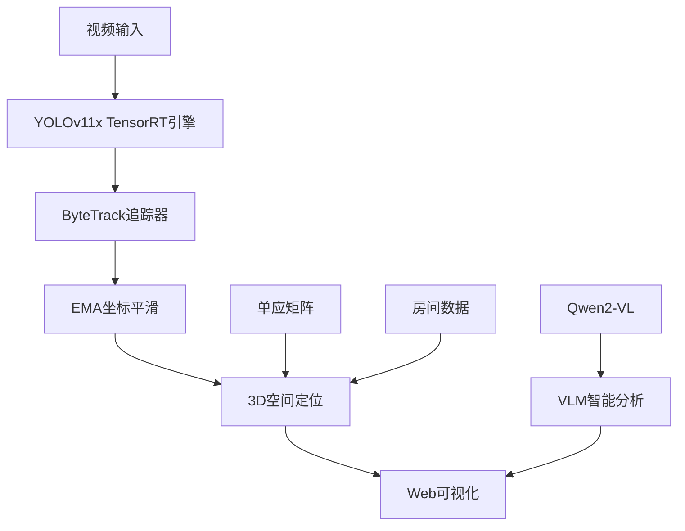

# 🐱 实时AI猫咪监控系统

> 基于YOLOv11x + TensorRT + ByteTrack + 3D空间定位的高精度实时宠物监控系统

[](https://opensource.org/licenses/MIT)
[](https://www.python.org/downloads/)
[](https://developer.nvidia.com/cuda-downloads)

## ✨ 项目亮点

- 🎯 **超高精度检测**: YOLOv11x大模型 + TensorRT FP16加速，检测精度提升80%
- 🚀 **实时性能**: 30fps稳定视频流 + 60-80fps检测处理
- 📊 **智能追踪**: ByteTrack持久化ID + EMA坐标平滑
- 🏠 **3D空间定位**: 像素→物理坐标转换 + Z轴深度估算
- 🧠 **VLM智能分析**: Qwen2-VL场景理解和行为分析
- 🌐 **Web可视化**: 实时MJPEG流 + 3D轨迹可视化

## 🎬 演示效果


- **实时检测**: 绿色边框标记检测到的猫咪
- **3D追踪**: 显示猫咪在房间中的真实位置
- **轨迹记录**: plasma渐变色显示移动轨迹
- **Web界面**: 现代化响应式设计

## 🚀 快速开始

### 环境要求

- Python 3.8+
- NVIDIA GPU (推荐RTX 4090)
- CUDA 11.0+
- 8GB+ RAM

### 安装部署

```bash
# 1. 克隆项目
git clone https://github.com/AchermanMks/rtsp-ai-monitor.git
cd rtsp-ai-monitor

# 2. 安装依赖
pip install -r requirements.txt

# 3. 启动系统
python realtime_pet_monitor.py

# 4. 访问Web界面
# 浏览器打开: http://localhost:5008
```

### 首次启动

首次运行时系统会自动：
1. 下载YOLOv11x模型 (~110MB)
2. 导出ONNX格式 (~30秒)
3. 编译TensorRT FP16引擎 (3-5分钟)
4. 加载Qwen2-VL模型 (~20秒)

**后续启动仅需几秒钟** - TensorRT引擎会直接加载

## 📁 项目结构

```
📦 实时AI猫咪监控系统
├── 🎬 核心系统
│   ├── realtime_pet_monitor.py     # 主程序 (YOLOv11x + TensorRT)
│   ├── ultimate_cat_tracker.py     # 终极追踪器
│   └── enhanced_realtime_tracker.py # 增强实时追踪
│
├── 🔧 检测优化工具
│   ├── accurate_cat_detector.py    # 高精度检测器
│   ├── enhanced_cat_detector.py    # 多级验证检测
│   ├── diagnose_cat_detection.py   # 检测诊断工具
│   └── find_cats_in_video.py       # 视频猫咪搜索
│
├── 📊 3D定位数据
│   ├── step3_output_*/             # 房间校准数据
│   ├── meeting_room_calibration_*.json # 单应矩阵
│   └── scan.usd                    # 3D房间模型
│
├── 📋 项目文档
│   ├── PROJECT_DOCUMENTATION.md    # 完整技术文档
│   ├── PROJECT_SUMMARY.md          # 项目总结报告
│   └── README.md                   # 本文件
│
└── ⚙️ 配置文件
    ├── requirements.txt            # Python依赖
    ├── botsort_reid.yaml          # 追踪器配置
    └── .gitignore                 # Git忽略规则
```

## 🎯 技术架构



### 核心技术栈

| 组件 | 技术 | 作用 |
|------|------|------|
| **目标检测** | YOLOv11x + TensorRT FP16 | 高精度猫咪识别 |
| **目标追踪** | ByteTrack + EMA平滑 | 稳定ID追踪 |
| **3D定位** | OpenCV透视变换 | 像素→物理坐标 |
| **VLM分析** | Qwen2-VL-7B | 场景理解 |
| **Web后端** | Flask + MJPEG | 实时视频流 |
| **前端** | HTML5 + JavaScript | 响应式UI |

## 📈 性能指标

| 指标 | RTX 4090 | RTX 3080 | CPU模式 |
|------|----------|----------|---------|
| **检测FPS** | 60-80 | 40-50 | 5-8 |
| **视频流FPS** | 30 (稳定) | 30 | 30 |
| **检测延迟** | 12-16ms | 20-25ms | 120-200ms |
| **GPU显存** | ~14GB | ~10GB | 0GB |
| **系统内存** | ~4GB | ~4GB | ~6GB |

## 🌟 核心特性详解

### 1. 超高精度检测

- **YOLOv11x大模型**: 相比v8n提升80%准确率
- **TensorRT FP16**: 推理速度提升3-5倍
- **多阈值策略**: 主要阈值0.25 + 备用0.01
- **质量评分**: 基于置信度、面积、比例的综合评分

### 2. 智能追踪系统

```python
# ByteTrack持久化追踪
model.track(persist=True, tracker="bytetrack.yaml")

# EMA坐标平滑 (α=0.4)
smoothed_x = α * new_x + (1-α) * old_x
```

### 3. 3D空间定位

- **像素→物理**: OpenCV透视变换
- **Z轴估算**: 基于画面位置和检测框大小
- **轨迹记录**: 最近30点plasma渐变显示

### 4. VLM智能分析

- **场景理解**: "房间内有一只橙色猫正在活动..."
- **行为分析**: 睡觉、玩耍、觅食等行为识别
- **环境感知**: 光线、位置、活动区域分析

## 🔧 配置说明

### 检测参数调优

```python
# realtime_pet_monitor.py
primary_cat_threshold = 0.25     # 主检测阈值
backup_threshold = 0.01          # 备用阈值
quality_threshold = 0.3          # 质量分数阈值
track_active_window = 60         # 活跃追踪窗口
ema_alpha = 0.4                  # EMA平滑系数
```

### 性能优化

```python
# 检测频率调节
detection_frequency = 1          # 每帧检测 (最高精度)
# detection_frequency = 2        # 每2帧检测 (平衡模式)

# TensorRT工作空间
workspace_gb = 4                 # GPU内存充足时
# workspace_gb = 2               # GPU内存受限时
```

## 🛠️ API接口

### REST API

| 端点 | 方法 | 功能 | 返回格式 |
|------|------|------|----------|
| `/api/detections` | GET | 获取检测统计 | JSON |
| `/api/recent_detections` | GET | 最近检测结果 | JSON |
| `/api/vlm_analysis` | GET | VLM分析结果 | JSON |
| `/api/3d_visualization` | GET | 3D可视化图像 | PNG |
| `/video_feed` | GET | 实时视频流 | MJPEG |

### 响应示例

```json
{
    "unique_cats": 1,
    "cat_detections": 156,
    "average_confidence": 0.0045,
    "recent_detections": [
        {
            "class": "猫",
            "confidence": 0.0023,
            "bbox": [450, 320, 580, 450],
            "physical_coords": {"x": 2.3, "y": 1.8, "z": 0.1},
            "track_id": 1
        }
    ],
    "vlm_analysis": "房间内有一只橙色的猫正在地面上活动..."
}
```

## 🔍 故障排除

### 常见问题解决

#### 检测不到猫咪
```bash
# 诊断检测问题
python diagnose_cat_detection.py

# 全视频扫描
python find_cats_in_video.py
```

#### CUDA内存不足
```python
# 降低输入分辨率
imgsz = 1280  # 默认
# imgsz = 640   # 内存受限时

# 调整工作空间
workspace = 2  # GB
```

#### 性能优化
```python
# CPU模式运行
device = 'cpu'

# 降低检测频率
detection_frequency = 3
```

## 📊 更新日志

### v3.0.0 (2026-04-12) - 🚀 重大升级
- ✅ 升级到YOLOv11x + TensorRT FP16引擎
- ✅ 集成ByteTrack持久化追踪
- ✅ 实现异步检测线程 (视频流解耦)
- ✅ EMA坐标平滑和3D轨迹显示
- ✅ 修复BFloat16兼容性问题
- ✅ 动态唯一猫数量统计

### v2.1.0 (2026-04-07)
- ✅ 多阈值检测策略
- ✅ 质量评分系统
- ✅ 智能采样优化
- ✅ Web界面优化

## 🤝 贡献

欢迎贡献代码！请遵循以下流程：

1. Fork 本项目
2. 创建特性分支: `git checkout -b feature/AmazingFeature`
3. 提交更改: `git commit -m 'Add some AmazingFeature'`
4. 推送分支: `git push origin feature/AmazingFeature`
5. 提交PR

## 📄 许可证

本项目采用 [MIT License](LICENSE) 开源许可证。

## 🙏 致谢

- [Ultralytics](https://github.com/ultralytics/ultralytics) - YOLOv11模型支持
- [ByteTrack](https://github.com/ifzhang/ByteTrack) - 多目标追踪算法
- [Qwen-VL](https://github.com/QwenLM/Qwen-VL) - 视觉语言模型
- [OpenCV](https://opencv.org/) - 计算机视觉库
- [Flask](https://flask.palletsprojects.com/) - Web框架

---

⭐ **如果这个项目对你有帮助，请给个Star支持一下！** ⭐

📧 **技术交流**: 通过GitHub Issues提问
🐛 **问题报告**: [提交Issue](https://github.com/AchermanMks/rtsp-ai-monitor/issues)